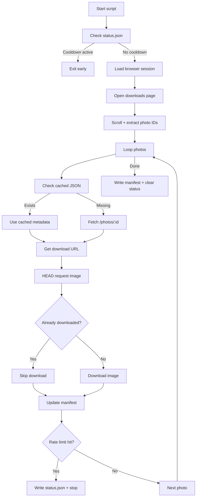

# Unsplash download tracker

This script synchronises a user's personal Unsplash download history into a local archive.

## What this does

This script builds a **local, repeatable, rate-limit-safe, cache-aware, API-compliant archive** of a user's Unsplash downloads:

Each run:

* reads your download history page
* builds a list of photo IDs
* uses cached metadata if available
* fetches missing metadata via API
* downloads missing or changed images
* writes everything into a structured archive

Output structure:

```plaintext
unsplash-archive/
unsplash-archive/images/ <photo files>
unsplash-archive/photos/ <photo metadata JSON>
unsplash-archive/manifest.json
unsplash-archive/status.json
```

## Workflow



## Setup

### 1. Create an Unsplash app

1. Go to: [https://unsplash.com/oauth/applications](https://unsplash.com/oauth/applications)
2. Create a new application
3. Accept the API guidelines
4. Copy access information into your local .env file

### 2. Environment variables

Set the following environment variables:

```ini
UNSPLASH_ACCESS_KEY=
UNSPLASH_SECRET_KEY=
UNSPLASH_AUTHORIZATION_TOKEN=
UNSPLASH_APP_ID=
UNSPLASH_STORAGE_STATE=./unsplash-storage-state.json
```

Notes:

* `UNSPLASH_AUTHORIZATION_TOKEN` is a Bearer token (OAuth)
* `UNSPLASH_ACCESS_KEY` is required for API access
* the script will fail fast if required variables are missing

DO NOT save this information in a repository. The typical setup for this kind of thing is that you have your personal local `~/.env` file in your home directory and set only the `UNSPLASH_STORAGE_STATE` variable locally via `.env`.

### 3. Authenticate browser session

You need an authenticated Unsplash session. Run: `node prepare-storage-state.ts` . This will:

* open a browser
* let you log in manually
* save session state to `./unsplash-storage-state.json`

The main script will reuse this file. DO NOT commit this file to a repository. It contains your authenticated browser session with full account rights on your Unsplash account and is used for Playwright to retrieve your download history.

## Usage

Run:

```bash
node index.ts --verbose
```

Optional flags (they do what's in their name):

```plaintext
--output-dir <path>
--refresh-all
--head-timeout-ms <ms>
--download-timeout-ms <ms>
--max-scroll-rounds <n>
--scroll-pause-ms <ms>
--verbose
```

## Caching behaviour

The script is designed to minimise API usage:

* metadata is stored in `photos/<id>.json`
* images are stored in `images/`
* checksum + headers are tracked in `manifest.json`

On reruns:

* metadata is reused
* unchanged images are skipped
* only missing items trigger API calls

## Rate limiting (important)

Unsplash enforces strict API rate limits.

### Documented limits

* Demo applications: **50 requests per hour**
* Production apps: higher limits after approval

Only requests to: `api.unsplash.com` count towards the limit. Image downloads from `images.unsplash.com` do **not** count.

### Behaviour in this script

This script **intentionally respects rate limits**:

* global delay between requests (default 2000ms)
* uses cached metadata to reduce API calls
* stops immediately on rate limit
* writes a local cooldown file

### status.json

When a rate limit is hit a `unsplash-archive/status.json` is created.

Example:

```json
{
  "blockedUntil": "2026-04-10T11:42:00.000Z",
  "reason": "Unsplash API rate limit reached",
  "limit": 50,
  "remaining": 0
}
```

On next run:

* script checks this file first
* exits early if still blocked

### Important note

This project **does not attempt to bypass or work around rate limits**.

That includes:

* no parallel request flooding
* no token rotation
* no scraping API endpoints in unsupported ways

If you hit the limit:

* wait ~1 hour
* run again

In optimum case this will lead to a local archive of your downloaded Unsplash images that should be easily updateable.

## Design decisions

### Why browser scraping for IDs?

Unsplash does not provide an API endpoint for:

> "all photos I have downloaded"

So we:

* load `https://unsplash.com/downloads`
* scroll the page
* extract photo IDs

**Problem:** It appears that downloads via API are also counted into the Download page. This might lead to images being shown double in the download page. Due to the caching strategy this won't lead to issues --- a downloaded image is not re-downloaded. Doubles are filtered by design. 

### Why REST API for metadata?

Because that is what an API is there for:

* it provides structured data
* it is stable
* it allows proper attribution and metadata storage

### Why tracked download URL and not retrieval of the hotlinkable image?

We use `/photos/:id/download`

because:

* it is required by Unsplash API guidelines
* it correctly registers downloads

## Limitations

* requires manual login once (storage state)
* depends on Unsplash frontend structure for ID extraction
* rate-limited by design
* initial run can take multiple runs over multiple hours for large histories

## Recommendations

* run the script regularly instead of once with a large backlog
* keep `GLOBAL_DELAY_MS` conservative
* don't apply for production API access - it's a script for your personal use

## Output guarantees

For each photo:

* metadata JSON stored
* image downloaded once
* checksum tracked
* file changes detected via:

  * ETag
  * Last-Modified
  * Content-Length
  * SHA256